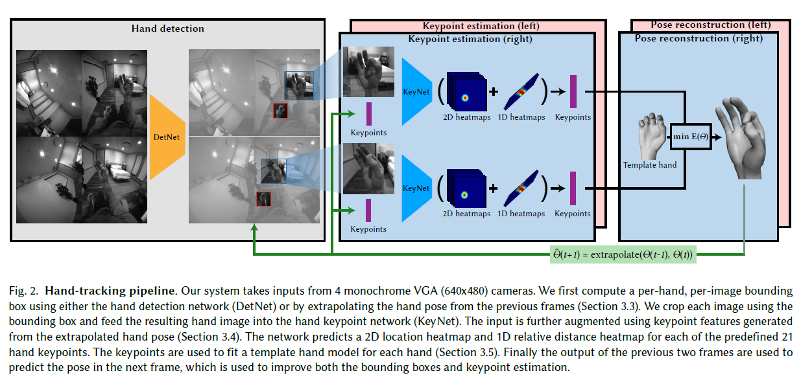
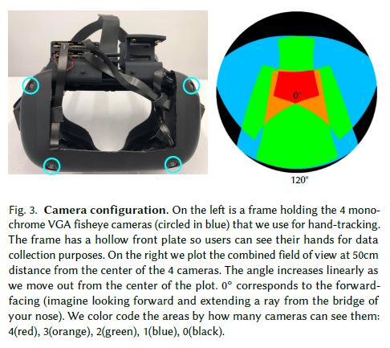
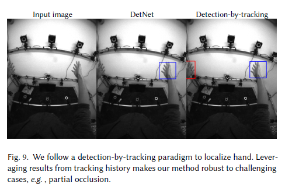
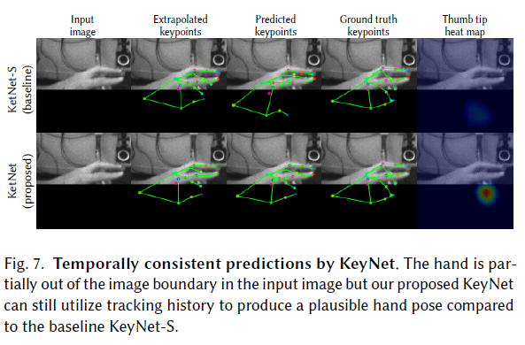
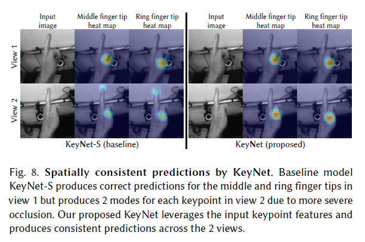
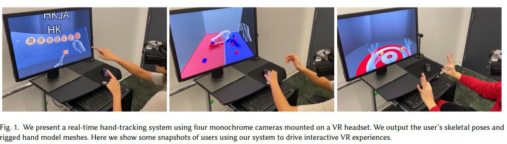
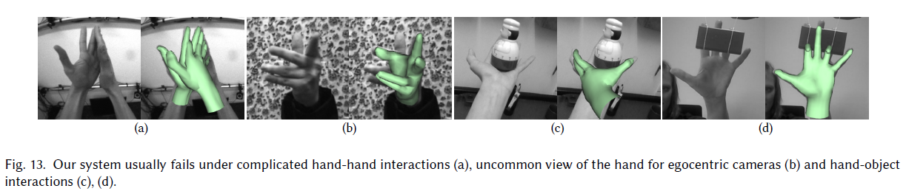

## MEgATrack

## Overview

It is a real-time hand-tracking system which can drive virtual and augmented reality (VR/AR) experiences. Using four fisheye monochrome cameras, the system generates accurate and low-jitter 3D hand motion across a large working volume for a diverse set of users. We achieve this by proposing neural network architectures for detecting hands and estimating hand keypoint locations. Our hand detection network robustly handles a variety of real world environments.

## Related Work

- ## RGB-based approaches  
Early RGB-based methods follow an analysis-by-synthesis paradigm, fitting a hand model to low level visual cues such as edges, skin color, silhouettes and optical flow. This is extremely challenging given the self-similarity, subtle color variation, and severe self-occlusion exhibited by hands.

- ## Depth-based approaches  
Depth sensors have been widely applied to hand-tracking. Model-based approaches can reliably fit a hand mesh to the reconstructed point cloud provided by the depth sensor, but this approach does not generalize to RGB images.

## Working

System starts by taking images from four monochrome cameras and detect the left and right hands in each image, producing a set of bounding boxes. Followed by cropping of bounding box from the image and pass it to a network that detects 21 keypoints on the hand. The resulting keypoints are then used to fit a 3D hand pose.

## Step 1: capturing images of hand through the use of four fisheye cameras 

Four VGA, synchronized, global-shutter cameras to drive our hand tracker. Each camera covers a 150◦ (width), 120◦ (height) and 175◦ (diagonal) FOV.

## Step 2: Hand detection

The task of hand detection is to find the bounding box of each hand in every input image. A key challenge is to ensure robustness to a variety of real world environments. To tackle this challenge, collected a large and varied hand detection dataset specific to this camera configuration using a semi-automatic labeling method and propose a simple and efficient CNN architecture which we name DetNet.
- ## Detection by Tracking  
In general, it is necessary to run DetNet on all four images to guarantee finding both hands in all views. Since we target mobile architectures, this is too expensive to run at every frame, even for our power-optimized DetNet architecture. To overcome this limitation we employ a detection-by-tracking approach when a tracked hand is available.

## Step 3: KeyPoint Detection

Keypoint estimation network, KeyNet, predicts the 21 keypoints on the hand from a crop of the image based on the predicted bounding box from the hand detection step. Previous work on keypoint estimation typically treats each image independently. This has several drawbacks for real-time, multi-camera systems. First, the quality of predictions will degrade when the hand moves between overlapping camera views as each view is handled independently and views where the hand is partially out-of-frame are problematic for keypoint estimation. Second, the keypoints tend to jitter, particularly for occluded fingers, because temporal consistency is not enforced. To resolve both problems, we structure our network to explicitly incorporate the extrapolated keypoints as an additional network input.

## Data Generation
In this work, depth tracker has been used to generate ground truth hand poses for training the keypoint estimation network. This model based tracker requires minimal human intervention (2D bounding boxes) if the tracker fails. The system maximizes the quality of the ground truth data without sacrificing mobility. As a result, training set is larger and more diverse in terms of hand shape, pose and background variation than any previously proposed RGB datasets.

## Applications

In various vedio games. The proposed system will be helpful and improve the user experience.

## Typical Failures and Future Works

The system currenlty struggles with heavy hand to hand interaction as well as hand-object interactions. The failures for hand-hand and hand-object interactions reflect both the limitation of our system design and the fundamental difficulty of these tasks. We believe jointly reasoning about the two hands and handheld objects is an important direction for a better hand-tracking system.

## Conclusion

We have presented a practical real-time hand-tracking system for VR/AR interaction. The system uses four egocentric fisheye cameras with partially overlapping FOV, enabling a large tracking volume. Our proposed hand detection network, DetNet, combined with a detection-by-tracking strategy gracefully handles hands moving between the multiple cameras. Our proposed keypoint estimation network, KeyNet, also leverages tracking information to achieve spatially and temporally consistent keypoint predictions, enabling our system to generate accurate, low-jitter hand motion suitable for interaction. Our model-based pose estimation and hand scale calibration use a traditional linear blend skinning rig, making it easy to incorporate into interactive experiences.

